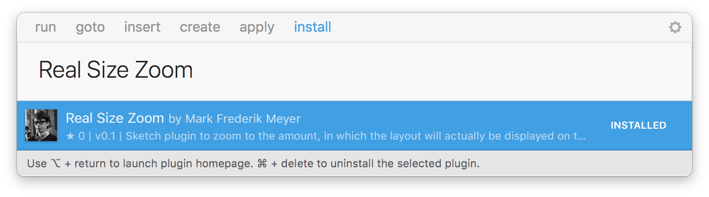

# Real Size Zoom For Sketch
A Sketch plugin that emulates InDesign's "zoom to real size" functionality.

## How to use
 1. Click "Setup your screen" and type in your screen width in cm as well as your pixel count in width (important: @1x).
 2. Click "Setup target screen" and type in the width of the screen your designing for as well as the pixel count in width (again important: @1x) of that screen.
 3. Press <kbd>Cmd</kbd> + <kbd>alt</kbd> + <kbd>r</kbd> to zoom to the size your actual device will be. 

## Notes
 * The information about your screen and the target screen are stored in the sketch file, so you will have to set it up for each sketch file individually. On the bright side, you can work for multiple target devices in different files and won't have to re-configure the plugin. You can view the current settings by clicking on "Show current settings"
 * If you are not sure about a specific screen size, you can view this table on [Wikipedia](https://en.wikipedia.org/wiki/Display_size)

## Install with Sketch Runner
With Sketch Runner, just go to the `install` command and search for `Real Size Zoom`. Runner allows you to manage plugins and do much more to speed up your workflow in Sketch. [Download Runner here](http://www.sketchrunner.com).

## Installation
 1. [Download](https://github.com/phytrisha/RealSizeZoom/archive/master.zip) the plugin.
 2. Unzip & run ‘RealSizeZoom.sketchplugin’ to install

## Created by
[Mark Meyer](https://github.com/phytrisha), Stuttgart (DE)
